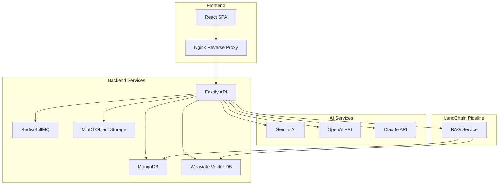

# 🚀 CortexReel Production Deployment Guide

**KILLER-666 AUTONOMOUS DEPLOYMENT PROTOCOL**

## 🎯 Quick Start (TL;DR)

```bash
# 1. Copy environment template
cp env.docker.example .env.docker

# 2. Edit API keys (REQUIRED)
nano .env.docker  # Add your Gemini API key

# 3. Deploy everything
./scripts/deploy.sh

# 4. Access application
open https://localhost
```

## 📋 Prerequisites

### System Requirements
- **Docker** 20.10+ with Docker Compose
- **OpenSSL** for certificate generation
- **4GB RAM** minimum, 8GB recommended
- **20GB storage** for Docker images and data

### API Keys Required
- **Google Gemini API Key** ([Get yours here](https://makersuite.google.com/app/apikey))
- **OpenAI API Key** (optional, for GPT models)
- **Claude API Key** (optional, for Anthropic models)

## 🏗️ Architecture Overview



## 🔧 Deployment Steps

### Step 1: Environment Setup

```bash
# Clone repository
git clone https://github.com/your-org/cortexreel.git
cd cortexreel

# Copy environment template
cp env.docker.example .env.docker
```

### Step 2: Configure API Keys

Edit `.env.docker` with your actual API keys:

```bash
# CRITICAL: Replace with your actual API keys
GEMINI_API_KEY=your_actual_gemini_api_key_here
OPENAI_API_KEY=your_actual_openai_api_key_here
CLAUDE_API_KEY=your_actual_claude_api_key_here
```

### Step 3: Deploy Infrastructure

```bash
# Run autonomous deployment
./scripts/deploy.sh

# Or step by step:
./scripts/deploy.sh deploy   # Full deployment
./scripts/deploy.sh health   # Health checks only
./scripts/deploy.sh logs     # View logs
```

### Step 4: Verify Deployment

The deployment script automatically performs health checks. Manual verification:

```bash
# Check all services
docker-compose ps

# Test endpoints
curl -k https://localhost/healthz
curl http://localhost:8080/v1/.well-known/ready  # Weaviate
curl http://localhost:9000/minio/health/live     # MinIO
```

## 📊 Services & Ports

| Service | Port | Purpose | Credentials |
|---------|------|---------|-------------|
| **Nginx** | 80, 443 | Reverse proxy, SSL termination | - |
| **Backend** | 3001 | Fastify API server | - |
| **MongoDB** | 27017 | Primary database | cortexreel / cortexreel_mongo_2024! |
| **Redis** | 6379 | Cache & job queue | cortexreel_redis_2024! |
| **Weaviate** | 8080 | Vector database | cortexreel-weaviate-key-2024 |
| **MinIO** | 9000, 9001 | Object storage | cortexreel / cortexreel_minio_2024! |

## 🔒 Security Configuration

### SSL/TLS
- Self-signed certificates auto-generated for development
- Production: Replace with Let's Encrypt or purchased certificates
- All HTTP traffic redirects to HTTPS

### Network Security
- All services run in isolated Docker network
- Only necessary ports exposed
- Rate limiting configured (10 req/s API, 2 req/s uploads)

### Default Passwords (CHANGE IN PRODUCTION)
```bash
# MongoDB
Username: cortexreel
Password: cortexreel_mongo_2024!

# Redis
Password: cortexreel_redis_2024!

# MinIO
Username: cortexreel
Password: cortexreel_minio_2024!

# Weaviate
API Key: cortexreel-weaviate-key-2024
```

## 🧪 Configuration Integration

The deployment includes **CRITICAL FIX** for configuration integration:

1. **Admin Dashboard** ✅ Fully functional
2. **Configuration Loading** ✅ AdminConfigService → Worker
3. **Dynamic LLM Models** ✅ Gemini/GPT/Claude switching
4. **Custom Prompts** ✅ Analysis sections use admin prompts
5. **Feature Toggles** ✅ OCR, exports, etc.

### Test Configuration Integration

1. Access admin panel: `https://localhost/admin`
2. Change LLM model from Gemini to GPT
3. Upload screenplay for analysis
4. Verify in browser console: "Using LLM model: gpt-4o"

## 📈 Monitoring & Maintenance

### View Logs
```bash
# All services
docker-compose logs -f

# Specific service
docker-compose logs -f backend
docker-compose logs -f mongodb
```

### Performance Monitoring
```bash
# Resource usage
docker stats

# Service health
./scripts/deploy.sh health
```

### Database Administration
```bash
# MongoDB shell
docker-compose exec mongodb mongosh -u cortexreel -p cortexreel_mongo_2024!

# Redis CLI
docker-compose exec redis redis-cli -a cortexreel_redis_2024!

# Weaviate console
open http://localhost:8080

# MinIO console
open http://localhost:9001
```

## 🔄 Maintenance Commands

```bash
# Restart services
./scripts/deploy.sh restart

# Stop all services
./scripts/deploy.sh stop

# Update deployment
git pull
./scripts/deploy.sh

# Clean everything (destructive)
./scripts/deploy.sh clean
```

## 🚨 Troubleshooting

### Common Issues

**1. Port Already in Use**
```bash
# Find process using port
lsof -i :80
lsof -i :443

# Kill conflicting services
sudo pkill nginx
sudo pkill apache2
```

**2. SSL Certificate Issues**
```bash
# Regenerate certificates
rm -rf ssl/
./scripts/deploy.sh
```

**3. API Key Not Working**
- Verify API key in `.env.docker`
- Check admin dashboard → LLM Configuration
- Review browser console for errors

**4. Services Won't Start**
```bash
# Check Docker resources
docker system df
docker system prune -f

# Rebuild images
docker-compose build --no-cache
```

**5. Database Connection Failed**
```bash
# Reset MongoDB
docker-compose down
docker volume rm cortexreel_mongodb_data
./scripts/deploy.sh
```

### Health Check Failures

If health checks fail:

```bash
# Check service logs
docker-compose logs mongodb
docker-compose logs redis
docker-compose logs weaviate

# Manual service testing
docker-compose exec mongodb mongosh --eval "db.runCommand('ping')"
docker-compose exec redis redis-cli ping
```

## 🎯 Production Deployment

### Required Changes for Production

1. **SSL Certificates**
   ```bash
   # Replace self-signed certs with Let's Encrypt
   certbot certonly --webroot -w /var/www/html -d yourdomain.com
   ```

2. **Passwords & Secrets**
   ```bash
   # Generate secure passwords
   openssl rand -base64 32  # For each service
   ```

3. **Environment Variables**
   ```bash
   # Production .env.docker
   NODE_ENV=production
   GEMINI_API_KEY=prod_key_here
   JWT_SECRET=$(openssl rand -base64 64)
   ```

4. **Firewall Configuration**
   ```bash
   # Only expose necessary ports
   ufw allow 80
   ufw allow 443
   ufw deny 27017  # MongoDB
   ufw deny 6379   # Redis
   ```

5. **Backup Strategy**
   ```bash
   # Automated backups
   crontab -e
   # 0 2 * * * /opt/cortexreel/backup.sh
   ```

## 📊 Performance Optimization

### Docker Compose Production Override

Create `docker-compose.prod.yml`:

```yaml
version: '3.8'
services:
  mongodb:
    deploy:
      resources:
        limits:
          memory: 2G
        reservations:
          memory: 1G
  
  redis:
    deploy:
      resources:
        limits:
          memory: 512M
          
  backend:
    deploy:
      replicas: 3
      resources:
        limits:
          memory: 1G
```

Deploy with:
```bash
docker-compose -f docker-compose.yml -f docker-compose.prod.yml up -d
```

## 🎉 Success Criteria

**✅ Deployment Successful When:**
1. All services pass health checks
2. HTTPS redirects working
3. Admin dashboard accessible
4. Screenplay analysis completes
5. Configuration changes take effect
6. No critical errors in logs

**🔥 MISSION STATUS: CORTEXREEL PRODUCTION-READY**

---

## 📞 Support & Maintenance

For deployment issues:
1. Check logs: `./scripts/deploy.sh logs`
2. Run health checks: `./scripts/deploy.sh health`
3. Review [troubleshooting section](#-troubleshooting)
4. Open GitHub issue with logs and error details

**Remember**: This is a **production-grade** deployment with enterprise security features. Change all default passwords and certificates before production use. 