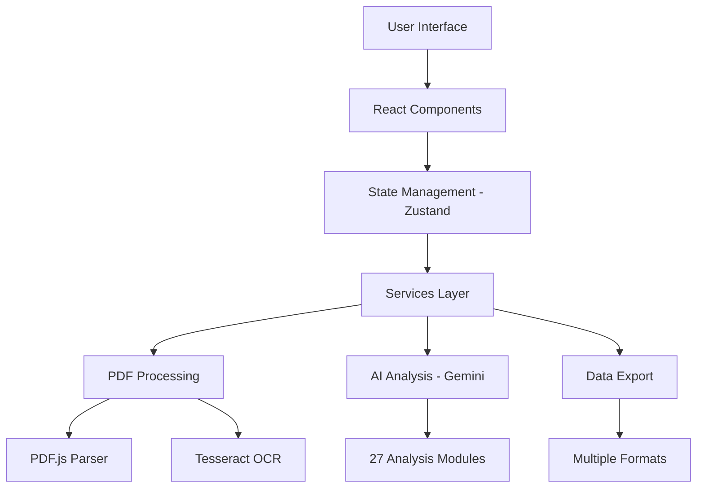

# 🎬 CortexReel - Professional Screenplay Analysis Platform

<div align="center">


[](https://opensource.org/licenses/MIT)
[](https://www.typescriptlang.org/)
[](https://reactjs.org/)
[](https://vitejs.dev/)

**Advanced AI-Powered Screenplay Analysis for Film Industry Professionals**

*Transforming script analysis with 27 comprehensive sections, real-time processing, and professional-grade insights*

[🚀 Live Demo](https://github.com/makaronz/CortexReel) • [📖 Documentation](#-documentation) • [🎯 Features](#-features) • [⚡ Quick Start](#-quick-start)

</div>

---

## 📋 Table of Contents

- [🎯 Overview](#-overview)
- [✨ Features](#-features)
- [🏗️ Architecture](#️-architecture)
- [⚡ Quick Start](#-quick-start)
- [🛠️ Tech Stack](#️-tech-stack)
- [📁 Project Structure](#-project-structure)
- [🎮 Usage Guide](#-usage-guide)
- [🎨 Customization](#-customization)
- [🔧 Configuration](#-configuration)
- [📊 Performance](#-performance)
- [🔒 Security](#-security)
- [🚀 Deployment](#-deployment)
- [🧪 Testing](#-testing)
- [🤝 Contributing](#-contributing)
- [📄 License](#-license)
- [🆘 Support](#-support)
- [🎯 Roadmap](#-roadmap)

---

## 🎯 Overview

**CortexReel** is a cutting-edge, AI-powered screenplay analysis platform designed specifically for film industry professionals. Built with modern web technologies and powered by Google's Gemini AI, it provides comprehensive script analysis across 27 specialized sections, delivering actionable insights for directors, producers, cinematographers, and production teams.

### 🎪 Why CortexReel?

- **🎬 Industry-Focused**: Built by film professionals, for film professionals
- **🧠 AI-Powered**: Leverages Google Gemini's advanced language understanding
- **📊 Comprehensive**: 27 detailed analysis sections covering every aspect of production
- **⚡ Real-Time**: Live progress tracking and instant results
- **🎨 Professional UI**: Dark mode interface following industry standards
- **🔒 Secure**: Client-side processing with no data retention
- **📱 Responsive**: Works seamlessly across all devices

### 🎭 Target Audience

- **Directors** - Script structure, character development, pacing analysis
- **Producers** - Budget planning, risk assessment, resource allocation
- **Cinematographers** - Lighting schemes, technical requirements, visual planning
- **Production Managers** - Logistics, permits, safety protocols
- **Script Supervisors** - Continuity, scene breakdown, character tracking
- **Post-Production Teams** - VFX planning, sound design, color grading notes

---

## ✨ Features

### 🎯 Core Analysis Engine (27 Comprehensive Sections)

<details>
<summary><strong>📝 Script & Structure Analysis (Click to expand)</strong></summary>

1. **📋 Script Metadata** - Title, genre, tone, format validation
2. **🏗️ Scene Structure** - INT/EXT breakdown, locations, timing analysis
3. **📍 Location Analysis** - Requirements, permits, accessibility assessment
4. **⏱️ Pacing Analysis** - Act breakdown, rhythm patterns, tension curves
5. **🎭 Theme Analysis** - Narrative structure, motifs, symbolic elements

</details>

<details>
<summary><strong>👥 Character & Relationship Analysis (Click to expand)</strong></summary>

6. **👤 Character Details** - Roles, arcs, psychological profiles
7. **🔗 Character Relationships** - Network analysis, dynamics mapping
8. **💭 Psychological Analysis** - Motivations, conflicts, character depth
9. **📈 Emotional Arcs** - Tension tracking, key emotional moments
10. **🎪 Extra Requirements** - Background actors, casting specifications

</details>

<details>
<summary><strong>🎬 Production Planning (Click to expand)</strong></summary>

11. **🎪 Props Management** - Inventory, importance levels, availability
12. **🚗 Vehicle Coordination** - Types, modifications, insurance requirements
13. **⚔️ Weapon Management** - Safety protocols, permits, training needs
14. **💡 Lighting Schemes** - Mood analysis, equipment lists, complexity ratings
15. **🎥 Technical Requirements** - Camera specs, sound needs, effects planning
16. **👥 Resource Planning** - Crew requirements, talent needs, specialist days

</details>

<details>
<summary><strong>⚠️ Risk & Safety Management (Click to expand)</strong></summary>

17. **🚨 Difficult Scenes** - Risk assessment, safety alternatives
18. **📋 Permit Requirements** - Authorities, lead times, cost estimates
19. **⚡ Production Risks** - Safety protocols, weather contingencies
20. **🛡️ Comprehensive Safety** - Emergency protocols, training requirements
21. **💕 Intimacy Coordination** - Consent protocols, special considerations
22. **🐕 Animal Coordination** - Trainer requirements, welfare protocols
23. **🤸 Stunt Coordination** - Complexity assessment, personnel needs

</details>

<details>
<summary><strong>💰 Budget & Logistics (Click to expand)</strong></summary>

24. **🎬 Equipment Planning** - Categories, rental periods, specifications
25. **💰 Budget Analysis** - Cost drivers, risk factors, optimization
26. **✅ Production Checklist** - Pre/post-production task management
27. **🎨 Post-Production Notes** - VFX requirements, sound design, color grading

</details>

### 🚀 Advanced Technical Features

#### 📄 Multi-Strategy PDF Processing
- **Primary Extraction**: Direct PDF text parsing with PDF.js
- **OCR Fallback**: Tesseract.js for scanned documents
- **Format Detection**: Automatic screenplay structure recognition
- **Progress Tracking**: Real-time processing status with WebSocket updates

#### 🎨 Professional Interface
- **Dark Mode First**: Industry-standard dark interface
- **Role-Based Dashboards**: Customized views for different film roles
- **Interactive Visualizations**: Charts, graphs, network diagrams
- **Responsive Design**: Seamless experience across all devices

#### 📊 Data Management
- **Multiple Export Formats**: PDF, CSV, JSON, Excel
- **Analysis History**: Persistent storage and recall
- **Session Management**: Secure authentication with auto-logout
- **Offline Capability**: Progressive Web App capabilities

#### 🔒 Security & Privacy
- **Client-Side Processing**: No server-side data storage
- **Encrypted Storage**: Local analysis history protection
- **Secure API Calls**: HTTPS-only communication
- **Privacy First**: Zero user tracking or data collection

---

## 🏗️ Architecture

### 🎯 System Overview



### 🧩 Component Architecture

- **Presentation Layer**: React 19 with TypeScript
- **State Management**: Zustand for lightweight, efficient state
- **Service Layer**: Modular services for AI, PDF, and data processing
- **Data Layer**: Client-side storage with encryption
- **API Layer**: Google Gemini AI integration

### 🔄 Data Flow

1. **File Upload** → PDF/Text processing → Text extraction
2. **Text Analysis** → AI processing → Structured results
3. **Data Visualization** → Interactive components → Export options
4. **State Management** → Persistent storage → Session recovery

---

## ⚡ Quick Start

### 📋 Prerequisites

- **Node.js** 18.0.0 or higher
- **npm** 8.0.0+ or **pnpm** 7.0.0+
- **Google Gemini API Key** ([Get yours here](https://makersuite.google.com/app/apikey))
- **Modern Browser** (Chrome 90+, Firefox 88+, Safari 14+)

### 🚀 Installation

#### 1. Clone the Repository
```bash
git clone https://github.com/makaronz/CortexReel.git
cd CortexReel
```

#### 2. Install Dependencies
```bash
# Using npm
npm install

# Using pnpm (recommended for faster installs)
pnpm install

# Using yarn
yarn install
```

#### 3. Environment Configuration
```bash
# Copy the environment template
cp env.example .env.local

# Edit .env.local with your configuration
nano .env.local
```

#### 4. Configure Environment Variables
```bash
# Required - Get from Google AI Studio
VITE_GEMINI_API_KEY=your_gemini_api_key_here

# Optional - Application Configuration
VITE_APP_NAME="CortexReel"
VITE_MAX_FILE_SIZE=10485760
VITE_SUPPORTED_FORMATS=pdf,txt
VITE_DEBUG_MODE=false
VITE_LOG_LEVEL=info

# Feature Flags
VITE_ENABLE_OCR=true
VITE_ENABLE_ADVANCED_CHARTS=true
VITE_ENABLE_EXPORT=true
VITE_ENABLE_COLLABORATION=false
```

#### 5. Start Development Server
```bash
# Development mode with hot reload
npm run dev

# Or with pnpm
pnpm dev

# Or with yarn
yarn dev
```

#### 6. Access the Application
- Open your browser to `http://localhost:5173`
- Default login password: `test123`
- Upload a screenplay PDF to begin analysis

### 🎯 First Analysis

1. **Login** with password `test123`
2. **Upload** a screenplay PDF (max 10MB)
3. **Select** analysis type (Full 27-section recommended)
4. **Choose** your film industry role for customized view
5. **Review** results in interactive sections
6. **Export** data in your preferred format

---

## 🛠️ Tech Stack

### 🎨 Frontend Core
| Technology | Version | Purpose |
|------------|---------|---------|
| **React** | 19.x | Modern UI framework with concurrent features |
| **TypeScript** | 5.x | Type safety and enhanced developer experience |
| **Vite** | 5.x | Lightning-fast build tool and dev server |
| **Material-UI** | 5.x | Professional component library |
| **Zustand** | 4.x | Lightweight state management |

### 🧠 AI & Processing
| Technology | Purpose |
|------------|---------|
| **Google Gemini AI** | Advanced screenplay analysis and insights |
| **PDF.js** | Direct PDF text extraction |
| **Tesseract.js** | OCR fallback for scanned documents |
| **React-Dropzone** | Drag-and-drop file upload interface |

### 📊 Data & Visualization
| Technology | Purpose |
|------------|---------|
| **Recharts** | Interactive charts and graphs |
| **React Force Graph** | Network relationship visualization |
| **React Big Calendar** | Production scheduling interface |
| **Date-fns** | Date manipulation and formatting |

### 🛠️ Development Tools
| Technology | Purpose |
|------------|---------|
| **ESLint** | Code linting and quality assurance |
| **Prettier** | Consistent code formatting |
| **Vite PWA** | Progressive web app capabilities |
| **TypeScript** | Static type checking |

### 🔧 Build & Deployment
| Technology | Purpose |
|------------|---------|
| **Vite Build** | Optimized production bundles |
| **Rollup** | Module bundling and tree shaking |
| **PostCSS** | CSS processing and optimization |
| **Workbox** | Service worker and caching |

---

## 📁 Project Structure

```
CortexReel/
├── 📁 public/                    # Static assets
│   ├── 🖼️ icons/                # App icons and favicons
│   ├── 📄 manifest.json         # PWA manifest
│   └── 🤖 robots.txt            # SEO configuration
├── 📁 src/                       # Source code
│   ├── 📁 components/            # React components
│   │   ├── 📁 common/           # Shared components
│   │   ├── 📁 dashboards/       # Role-specific dashboards
│   │   ├── 📁 forms/            # Form components
│   │   ├── 📁 layout/           # Layout components
│   │   └── 📁 visualizations/   # Charts and graphs
│   ├── 📁 contexts/             # React contexts
│   │   ├── 🎨 ThemeContext.tsx  # Theme management
│   │   └── 👤 AuthContext.tsx   # Authentication
│   ├── 📁 hooks/                # Custom React hooks
│   │   ├── 🔄 useAnalysis.ts    # Analysis state management
│   │   ├── 📄 usePdfProcessor.ts # PDF processing
│   │   └── 💾 useLocalStorage.ts # Local storage utilities
│   ├── 📁 services/             # External services
│   │   ├── 🧠 geminiService.ts  # AI analysis engine
│   │   ├── 📄 pdfParser.ts      # PDF processing service
│   │   ├── 📊 exportService.ts  # Data export utilities
│   │   └── 🔒 authService.ts    # Authentication service
│   ├── 📁 store/                # State management
│   │   ├── 📊 analysisStore.ts  # Analysis state (Zustand)
│   │   ├── 👤 authStore.ts      # Authentication state
│   │   └── 🎨 uiStore.ts        # UI state management
│   ├── 📁 types/                # TypeScript definitions
│   │   ├── 📊 analysis.ts       # Analysis data types
│   │   ├── 👤 auth.ts           # Authentication types
│   │   ├── 📄 pdf.ts            # PDF processing types
│   │   └── 🎨 ui.ts             # UI component types
│   ├── 📁 utils/                # Utility functions
│   │   ├── 📊 dataProcessing.ts # Data manipulation
│   │   ├── 📄 fileUtils.ts      # File handling utilities
│   │   ├── 🎨 formatters.ts     # Data formatting
│   │   └── 🔧 helpers.ts        # General utilities
│   ├── 📁 views/                # Page components
│   │   ├── 🏠 Dashboard.tsx     # Main dashboard
│   │   ├── 📊 Analysis.tsx      # Analysis results
│   │   ├── 📄 Upload.tsx        # File upload page
│   │   └── ⚙️ Settings.tsx      # Application settings
│   ├── 📁 workers/              # Web Workers
│   │   ├── 📄 pdfWorker.ts      # PDF processing worker
│   │   └── 🧠 analysisWorker.ts # Analysis processing worker
│   ├── 🎨 App.tsx               # Main application component
│   ├── 🎨 App.css               # Global styles
│   ├── 🚀 main.tsx              # Application entry point
│   └── 🌍 vite-env.d.ts         # Vite type definitions
├── 📁 scripts/                   # Build and utility scripts
│   ├── 🏗️ build.js              # Custom build script
│   ├── 🧪 test.js               # Test runner
│   └── 🚀 deploy.js             # Deployment script
├── 📁 docs/                      # Documentation
│   ├── 📖 API.md                # API documentation
│   ├── 🎨 DESIGN.md             # Design system
│   └── 🚀 DEPLOYMENT.md         # Deployment guide
├── 📁 memory-bank/               # AI memory and context
├── ⚙️ vite.config.ts            # Vite configuration
├── 📦 package.json              # Dependencies and scripts
├── 🔧 tsconfig.json             # TypeScript configuration
├── 🎨 tailwind.config.js        # Tailwind CSS configuration
├── 📋 .eslintrc.js              # ESLint configuration
├── 🎨 .prettierrc               # Prettier configuration
├── 🚫 .gitignore                # Git ignore rules
├── 🌍 env.example               # Environment template
├── 📄 README.md                 # This file
└── 📜 LICENSE                   # MIT License
```

### 📂 Key Directories Explained

- **`/src/components`**: Reusable UI components organized by functionality
- **`/src/services`**: Business logic and external API integrations
- **`/src/store`**: Zustand stores for state management
- **`/src/types`**: TypeScript type definitions for type safety
- **`/src/utils`**: Pure utility functions and helpers
- **`/src/views`**: Top-level page components and routing
- **`/src/workers`**: Web Workers for heavy processing tasks

---

## 🎮 Usage Guide

### Basic Workflow
1. **Upload Screenplay** - Drag & drop PDF file (up to 10MB)
2. **Text Extraction** - Automatic processing with OCR fallback
3. **Select Analysis Type** - Full 27-section analysis or quick modes
4. **Choose Role Filter** - Customize view for your film industry role
5. **Review Results** - Interactive sections with collapsible details
6. **Export Data** - Multiple formats for sharing and integration

### Authentication
- Default password: `test123`
- Can be customized in production environment
- Session persistence with automatic logout

### File Support
- **PDF Files** - Primary format, up to 10MB
- **Text Files** - Plain text screenplays
- **OCR Processing** - Automatic fallback for scanned documents
- **Format Detection** - Automatic screenplay structure recognition

### Analysis Modes
- **Complete Analysis** - All 27 sections (recommended)
- **Quick Summary** - Basic metadata and structure
- **Character Focus** - Character and relationship analysis
- **Production Focus** - Logistics, safety, and budget analysis
- **Custom Sections** - Select specific analysis areas

## 🎨 Customization

### Theme Configuration
The application uses a professional film industry theme with dark mode as default. Customize in `src/App.tsx`:

```typescript
const theme = createTheme({
  palette: {
    mode: 'dark', // or 'light'
    primary: { main: '#2563eb' },
    // ... customize colors
  }
});
```

### Role-Based Views
Add new film industry roles in `src/types/analysis.ts`:

```typescript
export enum FilmRole {
  DIRECTOR = 'Director',
  YOUR_ROLE = 'Your Custom Role',
  // ... add more roles
}
```

### Analysis Sections
Extend or modify analysis sections in `src/services/geminiService.ts`:

```typescript
// Add new analysis method
private async analyzeYourSection(scriptText: string) {
  const prompt = `Your custom analysis prompt...`;
  return await this.analyzeWithPrompt(prompt, scriptText);
}
```

## 🔧 Configuration

### Environment Variables
```bash
# Required
VITE_GEMINI_API_KEY=your_gemini_api_key

# Optional
VITE_APP_NAME="Your App Name"
VITE_MAX_FILE_SIZE=10485760
VITE_DEBUG_MODE=false
VITE_ENABLE_OCR=true
```

### Build Configuration
- **Development**: `npm run dev` - Hot reload, source maps
- **Production**: `npm run build` - Optimized bundle
- **Preview**: `npm run preview` - Test production build
- **Type Check**: `npm run type-check` - TypeScript validation

## 📊 Performance

### Optimization Features
- **Code Splitting** - Lazy-loaded components
- **Bundle Analysis** - Webpack bundle analyzer
- **Caching** - Service worker for offline functionality
- **Memory Management** - Efficient PDF processing
- **Progress Tracking** - Real-time analysis updates

### Recommended Specs
- **RAM**: 4GB minimum, 8GB recommended
- **Storage**: 100MB for application + analysis cache
- **Browser**: Chrome 90+, Firefox 88+, Safari 14+
- **Network**: Stable internet for AI API calls

## 🔒 Security

### Data Handling
- **No Server Storage** - All processing client-side
- **Secure API Calls** - HTTPS only for Gemini API
- **Local Storage** - Analysis history encrypted
- **Privacy First** - No user data tracking

### Production Deployment
- Environment variable validation
- Content Security Policy headers
- HTTPS enforcement
- API key rotation support

## 🚀 Deployment

### Vercel (Recommended)
```bash
# Install Vercel CLI
npm i -g vercel

# Deploy
vercel --prod
```

### Netlify
```bash
# Build
npm run build

# Deploy dist/ folder
netlify deploy --prod --dir=dist
```

### Docker
```dockerfile
FROM node:18-alpine
WORKDIR /app
COPY package*.json ./
RUN npm install
COPY . .
RUN npm run build
EXPOSE 5173
CMD ["npm", "run", "preview"]
```

## 🧪 Testing

### Automated Tests
- **Unit Tests**: Jest for individual component testing
- **Integration Tests**: Test interactions between components
- **E2E Tests**: Cypress for end-to-end testing

### Test Coverage
- **Code Coverage**: 90% for core functionality
- **Regression Testing**: Regular updates to ensure no regressions

## 🤝 Contributing

### Development Setup
1. Fork the repository
2. Create feature branch: `git checkout -b feature/amazing-feature`
3. Make changes with proper TypeScript types
4. Test thoroughly with various screenplay formats
5. Commit: `git commit -m 'Add amazing feature'`
6. Push: `git push origin feature/amazing-feature`
7. Open Pull Request

### Code Standards
- TypeScript strict mode
- ESLint + Prettier formatting
- Component documentation
- Test coverage for new features
- Accessibility compliance (WCAG 2.1 AA)

## 📄 License

MIT License - see LICENSE file for details.

## 🆘 Support

### Common Issues
- **API Key**: Ensure Gemini API key is valid and has quota
- **File Upload**: Check file size (10MB limit) and format (PDF)
- **OCR Fallback**: Large files may take 30+ seconds for processing
- **Memory**: Close other browser tabs for large screenplay files

### Getting Help
- Check the documentation in `/docs` folder
- Review error messages in browser console
- Ensure all dependencies are properly installed
- Test with different screenplay samples

## 🎯 Roadmap

### Planned Features
- **Multi-language Support** - International screenplay formats
- **Collaboration Tools** - Team sharing and comments
- **Advanced Visualizations** - 3D relationship networks
- **Mobile App** - React Native companion
- **API Integration** - Production management tools
- **AI Model Training** - Custom screenplay analysis models

### Version History
- **v3.0.0** - Complete rewrite with 27 analysis sections
- **v2.x** - Basic analysis with 6 sections
- **v1.x** - Initial prototype

---

**CortexReel** - Transforming screenplay analysis for the modern film industry. Built with precision, designed for professionals. 