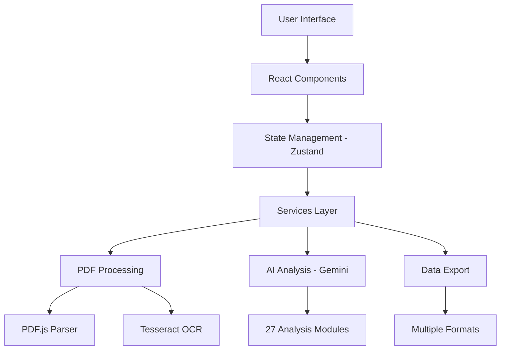

# 🎬 CortexReel - Professional Screenplay Analysis Platform

<div align="center">


[](https://opensource.org/licenses/MIT)
[](https://www.typescriptlang.org/)
[](https://reactjs.org/)
[](https://vitejs.dev/)

**Advanced AI-Powered Screenplay Analysis for Film Industry Professionals**

*Transforming script analysis with 27 comprehensive sections, real-time processing, and professional-grade insights*

[🚀 Live Demo](https://github.com/makaronz/CortexReel) • [📖 Documentation](#-documentation) • [🎯 Features](#-features) • [⚡ Quick Start](#-quick-start)

</div>

---

## 📋 Table of Contents

- [🎯 Overview](#-overview)
- [✨ Features](#-features)
- [🏗️ Architecture](#️-architecture)
- [⚡ Quick Start](#-quick-start)
- [🛠️ Tech Stack](#️-tech-stack)
- [📁 Project Structure](#-project-structure)
- [🎮 Usage Guide](#-usage-guide)
- [🎨 Customization](#-customization)
- [🔧 Configuration](#-configuration)
- [📊 Performance](#-performance)
- [🔒 Security](#-security)
- [🚀 Deployment](#-deployment)
- [🧪 Testing](#-testing)
- [🤝 Contributing](#-contributing)
- [📄 License](#-license)
- [🆘 Support](#-support)
- [🎯 Roadmap](#-roadmap)

---

## 🎯 Overview

**CortexReel** is a cutting-edge, AI-powered screenplay analysis platform designed specifically for film industry professionals. Built with modern web technologies and powered by Google's Gemini AI, it provides comprehensive script analysis across 27 specialized sections, delivering actionable insights for directors, producers, cinematographers, and production teams.

> "No film is ever really finished; it merely escapes." — Orson Welles  
>  
> CortexReel is the red pill for beleaguered script departments. Imagine Neo dodging bullets in *The Matrix* (1999) — now swap bullets for page counts. Since **v3** we've bolted a LangChain-powered RAG engine onto the chassis à la *Mad Max: Fury Road* (2015). MongoDB, Weaviate and BullMQ roar behind the scenes while your Admin Dashboard feeds configurations straight into the pipeline faster than you can mutter "I am vengeance." (*The Batman*, 2022)

### 🎪 Why CortexReel?

- **🎬 Industry-Focused**: Built by film professionals, for film professionals
- **🧠 AI-Powered**: Leverages Google Gemini's advanced language understanding
- **📊 Comprehensive**: 27 detailed analysis sections covering every aspect of production
- **⚡ Real-Time**: Live progress tracking and instant results
- **🎨 Professional UI**: Dark mode interface following industry standards
- **🔒 Secure**: Client-side processing with no data retention
- **📱 Responsive**: Works seamlessly across all devices
- **🤖 Full-Stack Muscle**: LangChain RAG backend with MongoDB, Weaviate & BullMQ — scalable, secure, "witness me!"

### 🎭 Target Audience

- **Directors** - Script structure, character development, pacing analysis
- **Producers** - Budget planning, risk assessment, resource allocation
- **Cinematographers** - Lighting schemes, technical requirements, visual planning
- **Production Managers** - Logistics, permits, safety protocols
- **Script Supervisors** - Continuity, scene breakdown, character tracking
- **Post-Production Teams** - VFX planning, sound design, color grading notes

---

## ✨ Features

### 🎯 Core Analysis Engine (27 Comprehensive Sections)

<details>
<summary><strong>📝 Script & Structure Analysis (Click to expand)</strong></summary>

1. **📋 Script Metadata** - Title, genre, tone, format validation
2. **🏗️ Scene Structure** - INT/EXT breakdown, locations, timing analysis
3. **📍 Location Analysis** - Requirements, permits, accessibility assessment
4. **⏱️ Pacing Analysis** - Act breakdown, rhythm patterns, tension curves
5. **🎭 Theme Analysis** - Narrative structure, motifs, symbolic elements

</details>

<details>
<summary><strong>👥 Character & Relationship Analysis (Click to expand)</strong></summary>

6. **👤 Character Details** - Roles, arcs, psychological profiles
7. **🔗 Character Relationships** - Network analysis, dynamics mapping
8. **💭 Psychological Analysis** - Motivations, conflicts, character depth
9. **📈 Emotional Arcs** - Tension tracking, key emotional moments
10. **🎪 Extra Requirements** - Background actors, casting specifications

</details>

<details>
<summary><strong>🎬 Production Planning (Click to expand)</strong></summary>

11. **🎪 Props Management** - Inventory, importance levels, availability
12. **🚗 Vehicle Coordination** - Types, modifications, insurance requirements
13. **⚔️ Weapon Management** - Safety protocols, permits, training needs
14. **💡 Lighting Schemes** - Mood analysis, equipment lists, complexity ratings
15. **🎥 Technical Requirements** - Camera specs, sound needs, effects planning
16. **👥 Resource Planning** - Crew requirements, talent needs, specialist days

</details>

<details>
<summary><strong>⚠️ Risk & Safety Management (Click to expand)</strong></summary>

17. **🚨 Difficult Scenes** - Risk assessment, safety alternatives
18. **📋 Permit Requirements** - Authorities, lead times, cost estimates
19. **⚡ Production Risks** - Safety protocols, weather contingencies
20. **🛡️ Comprehensive Safety** - Emergency protocols, training requirements
21. **💕 Intimacy Coordination** - Consent protocols, special considerations
22. **🐕 Animal Coordination** - Trainer requirements, welfare protocols
23. **🤸 Stunt Coordination** - Complexity assessment, personnel needs

</details>

<details>
<summary><strong>💰 Budget & Logistics (Click to expand)</strong></summary>

24. **🎬 Equipment Planning** - Categories, rental periods, specifications
25. **💰 Budget Analysis** - Cost drivers, risk factors, optimization
26. **✅ Production Checklist** - Pre/post-production task management
27. **🎨 Post-Production Notes** - VFX requirements, sound design, color grading

</details>

### 🚀 Advanced Technical Features

#### 📄 Multi-Strategy PDF Processing
- **Primary Extraction**: Direct PDF text parsing with PDF.js
- **OCR Fallback**: Tesseract.js for scanned documents
- **Format Detection**: Automatic screenplay structure recognition
- **Progress Tracking**: Real-time processing status with WebSocket updates

#### 🎨 Professional Interface
- **Dark Mode First**: Industry-standard dark interface
- **Role-Based Dashboards**: Customized views for different film roles
- **Interactive Visualizations**: Charts, graphs, network diagrams
- **Responsive Design**: Seamless experience across all devices

#### 📊 Data Management
- **Multiple Export Formats**: PDF, CSV, JSON, Excel
- **Analysis History**: Persistent storage and recall
- **Session Management**: Secure authentication with auto-logout
- **Offline Capability**: Progressive Web App capabilities

#### 🔒 Security & Privacy
- **Client-Side Processing**: No server-side data storage
- **Encrypted Storage**: Local analysis history protection
- **Secure API Calls**: HTTPS-only communication
- **Privacy First**: Zero user tracking or data collection

---

## 🏗️ Architecture

### 🎯 System Overview



### 🧩 Component Architecture

- **Presentation Layer**: React 19 with TypeScript
- **State Management**: Zustand for lightweight, efficient state
- **Service Layer**: Modular services for AI, PDF, and data processing
- **Data Layer**: Client-side storage with encryption
- **API Layer**: Google Gemini AI integration

### 🔄 Data Flow

1. **File Upload** → PDF/Text processing → Text extraction
2. **Text Analysis** → AI processing → Structured results
3. **Data Visualization** → Interactive components → Export options
4. **State Management** → Persistent storage → Session recovery

---

## ⚡ Quick Start

### 📋 Prerequisites

- **Node.js** 18.0.0 or higher
- **npm** 8.0.0+ or **pnpm** 7.0.0+
- **Google Gemini API Key** ([Get yours here](https://makersuite.google.com/app/apikey))
- **Modern Browser** (Chrome 90+, Firefox 88+, Safari 14+)

### 🚀 Installation

#### 1. Clone the Repository
   ```bash
git clone https://github.com/makaronz/CortexReel.git
   cd CortexReel
   ```

#### 2. Install Dependencies
   ```bash
# Using npm
   npm install

# Using pnpm (recommended for faster installs)
   pnpm install

# Using yarn
yarn install
   ```

#### 3. Environment Configuration
   ```bash
# Copy the environment template
   cp env.example .env.local
   
# Edit .env.local with your configuration
nano .env.local
```

#### 4. Configure Environment Variables
```bash
# Required - Get from Google AI Studio
VITE_GEMINI_API_KEY=your_gemini_api_key_here

# Optional - Application Configuration
VITE_APP_NAME="CortexReel"
VITE_MAX_FILE_SIZE=10485760
VITE_SUPPORTED_FORMATS=pdf,txt
VITE_DEBUG_MODE=false
VITE_LOG_LEVEL=info

# Feature Flags
VITE_ENABLE_OCR=true
VITE_ENABLE_ADVANCED_CHARTS=true
VITE_ENABLE_EXPORT=true
VITE_ENABLE_COLLABORATION=false
```

#### 5. Start Development Server
   ```bash
# Development mode with hot reload
   npm run dev

# Or with pnpm
   pnpm dev

# Or with yarn
yarn dev
   ```

#### 6. Access the Application
- Open your browser to `http://localhost:5173`
- Default login password: `test123`
- Upload a screenplay PDF to begin analysis

### 🎯 First Analysis

1. **Login** with password `test123`
2. **Upload** a screenplay PDF (max 10MB)
3. **Select** analysis type (Full 27-section recommended)
4. **Choose** your film industry role for customized view
5. **Review** results in interactive sections
6. **Export** data in your preferred format

### 📋 Manual QA Testing Guide

#### **Scenario 1: File Size and Type Validation**
```bash
# Test Case: Oversized PDF validation
1. Navigate to upload area
2. Attempt to upload PDF > 10MB
3. ✅ Expected: "Plik przekracza limit rozmiaru 10MB" error message
4. ✅ Expected: File rejected, no processing started

# Test Case: Invalid file format
1. Try uploading .txt, .docx, .exe files
2. ✅ Expected: "Nieobsługiwany format pliku" error for non-PDFs
3. ✅ Expected: Security error for suspicious extensions (.exe, .scr)

# Test Case: Edge cases
1. Upload 0-byte file
2. ✅ Expected: "Plik jest pusty" error
3. Upload file with 300+ character filename
4. ✅ Expected: "Nazwa pliku jest zbyt długa" error
```

#### **Scenario 2: Network Connectivity Testing**
```bash
# Test Case: Network disconnection during upload
1. Start uploading a valid PDF
2. Disconnect network connection immediately
3. ✅ Expected: Retry mechanism activates with "Network error" message
4. Reconnect network
5. ✅ Expected: Processing resumes or restart option provided

# Test Case: API timeout simulation
1. Upload large PDF (5-10MB)
2. Monitor network tab for timeout errors
3. ✅ Expected: Retry logic with exponential backoff
4. ✅ Expected: User-friendly timeout messages in Polish
```

#### **Scenario 3: PDF Processing Edge Cases**
```bash
# Test Case: Scanned PDF (OCR required)
1. Upload image-based PDF (scanned document)
2. ✅ Expected: Direct extraction fails gracefully
3. ✅ Expected: OCR fallback activates with progress indicators
4. ✅ Expected: "OCR Processing" stage visible in progress bar
5. ✅ Expected: Final result includes OCR-extracted text

# Test Case: Password-protected PDF
1. Upload encrypted/password-protected PDF
2. ✅ Expected: "PDF jest chroniony hasłem" error message
3. ✅ Expected: Clear instructions to remove protection

# Test Case: Corrupted PDF
1. Upload damaged/corrupted PDF file
2. ✅ Expected: "Plik PDF jest uszkodzony" error message
3. ✅ Expected: Suggestion to try different file
```

#### **Scenario 4: Admin Configuration Integration**
```bash
# Test Case: LLM Model Switching
1. Go to Admin Panel → LLM Configuration
2. Change model from Gemini to GPT-4
3. Save configuration
4. Upload new screenplay
5. ✅ Expected: Analysis uses new model (check network requests)
6. ✅ Expected: API calls go to correct endpoint

# Test Case: Custom Prompt Configuration
1. Admin Panel → Prompts Management
2. Modify "Scene Structure Analysis" prompt
3. Save changes
4. Run new analysis
5. ✅ Expected: Custom prompt used in API calls
6. ✅ Expected: Analysis reflects custom prompt instructions

# Test Case: Feature Toggle Testing
1. Admin Panel → App Settings
2. Disable "OCR Fallback" feature
3. Save configuration
4. Upload scanned PDF
5. ✅ Expected: OCR fallback disabled, direct extraction only
6. ✅ Expected: Appropriate error if text extraction fails
```

#### **Scenario 5: Analysis Progress and Error Recovery**
```bash
# Test Case: Long-running analysis interruption
1. Start analysis of complex screenplay
2. Close browser tab during processing
3. Reopen application
4. ✅ Expected: Analysis status recovered or restart option
5. ✅ Expected: No corrupt state in localStorage

# Test Case: API quota exceeded
1. Configure invalid/expired API key in Admin Panel
2. Attempt analysis
3. ✅ Expected: "Klucz API jest nieprawidłowy" error
4. ✅ Expected: Clear instructions to update key in Admin Panel

# Test Case: Partial analysis failure
1. Start analysis and simulate network issues mid-process
2. ✅ Expected: Partial results preserved
3. ✅ Expected: Option to retry failed sections
4. ✅ Expected: Clear indication of completed vs failed sections
```

#### **Scenario 6: Performance and Memory Testing**
```bash
# Test Case: Large file processing
1. Upload maximum size PDF (10MB)
2. Monitor browser memory usage
3. ✅ Expected: Memory usage stays below 1GB
4. ✅ Expected: Progress indicators remain responsive
5. ✅ Expected: Analysis completes within reasonable time (5-10 minutes)

# Test Case: Multiple file processing
1. Complete analysis of one screenplay
2. Immediately upload another without page refresh
3. ✅ Expected: Previous analysis data cleared properly
4. ✅ Expected: No memory leaks or performance degradation
5. ✅ Expected: New analysis starts with clean state
```

#### **Scenario 7: User Experience Validation**
```bash
# Test Case: Polish language consistency
1. Navigate through entire application
2. Trigger various error scenarios
3. ✅ Expected: All user-facing messages in Polish
4. ✅ Expected: Consistent terminology throughout
5. ✅ Expected: Professional tone appropriate for film industry

# Test Case: Loading state indicators
1. Upload PDF and monitor all loading states
2. ✅ Expected: Loading overlay during file processing
3. ✅ Expected: Progress bar with meaningful stage descriptions
4. ✅ Expected: Estimated time remaining updates
5. ✅ Expected: Section-by-section completion tracking

# Test Case: Admin Panel accessibility
1. Navigate admin panel using only keyboard
2. Test with screen reader
3. ✅ Expected: All controls keyboard accessible
4. ✅ Expected: Proper ARIA labels and roles
5. ✅ Expected: Focus management works correctly
```

### Automated Test Verification

Run comprehensive test suite before manual QA:

```bash
# Run all tests
npm run test

# Run specific test suites
npm run test -- --run src/__tests__/pdfParser.test.ts
npm run test -- --run src/__tests__/retry.test.ts

# Check test coverage
npm run test:coverage
```

## 🔧 Configuration Management

### Environment Variables

Create `.env.local` with required configuration:

```env
# Required
VITE_GEMINI_API_KEY=your_gemini_api_key_here

# Optional
VITE_APP_NAME=CortexReel
VITE_MAX_FILE_SIZE_MB=10
VITE_DEBUG_MODE=false
```

### Admin Dashboard Configuration

Access admin panel at `/admin` to configure:

- **LLM Settings**: API keys, model selection, generation parameters
- **Prompt Management**: Custom analysis prompts with version control
- **Application Settings**: File limits, feature toggles, logging levels

## 📊 Performance Monitoring

### Key Metrics to Monitor

- **Initial Load Time**: Target <3 seconds
- **PDF Processing Time**: 30 seconds - 5 minutes depending on size and complexity
- **Memory Usage**: Should remain stable <500MB for normal sessions
- **Analysis Completion Rate**: Target >95% success rate

### Performance Debugging

```bash
# Enable debug mode for detailed logging
localStorage.setItem('cortexreel_debug', 'true')

# Monitor performance in browser dev tools
# - Network tab: API call timings
# - Memory tab: Memory usage patterns
# - Console: Detailed processing logs
```

## 🛠️ Development Guidelines

### Code Quality Standards

- **TypeScript**: Strict mode enabled, 95%+ coverage required
- **Testing**: Comprehensive unit and integration tests
- **Error Handling**: Graceful degradation with user-friendly messages
- **Performance**: Optimized for film industry professional workflows

### Adding New Features

1. **Read Memory Bank**: Always start by reading all files in `memory-bank/`
2. **Follow Patterns**: Use established architectural patterns
3. **Update Tests**: Add comprehensive test coverage
4. **Update Documentation**: Keep README and JSDoc current

### File Size and Format Guidelines

- **Maximum PDF Size**: 10MB (configurable in Admin Panel)
- **Supported Formats**: PDF only (with .pdf extension)
- **Processing Strategy**: Direct text extraction → OCR fallback
- **Text Validation**: Minimum 50 characters, 25 words for successful extraction

## 🚨 Troubleshooting

### Common Issues

#### PDF Upload Failures
```bash
# Check file size and format
console.log('File size:', file.size / 1024 / 1024, 'MB');
console.log('File type:', file.type);

# Verify PDF parser service
PDFParserService.validateFileSize(file);
PDFParserService.getSupportedFormats();
```

#### Analysis Failures
```bash
# Check API key configuration
AdminConfigService.getLLMConfig().then(config => 
  console.log('API Key present:', !!config.apiKey)
);

# Monitor network requests
# Look for 401 (unauthorized) or 429 (rate limit) errors
```

#### Memory Issues
```bash
# Clear application state
localStorage.clear();
location.reload();

# Monitor memory usage
console.log('Memory usage:', performance.memory?.usedJSHeapSize / 1024 / 1024, 'MB');
```

### Support Information

For additional support:
- Review Memory Bank documentation in `memory-bank/`
- Check browser console for detailed error messages
- Verify Admin Panel configuration
- Test with smaller PDF files first

## 📖 Architecture Documentation

Detailed technical documentation available in:
- `memory-bank/systemPatterns.md` - Technical architecture
- `memory-bank/productContext.md` - Product requirements
- `diagrams/` - System architecture diagrams

---

## 🎮 Usage Guide

### Basic Workflow
1. **Upload Screenplay** - Drag & drop PDF file (up to 10MB)
2. **Text Extraction** - Automatic processing with OCR fallback
3. **Select Analysis Type** - Full 27-section analysis or quick modes
4. **Choose Role Filter** - Customize view for your film industry role
5. **Review Results** - Interactive sections with collapsible details
6. **Export Data** - Multiple formats for sharing and integration

### Authentication
- Default password: `test123`
- Can be customized in production environment
- Session persistence with automatic logout

### File Support
- **PDF Files** - Primary format, up to 10MB
- **Text Files** - Plain text screenplays
- **OCR Processing** - Automatic fallback for scanned documents
- **Format Detection** - Automatic screenplay structure recognition

### Analysis Modes
- **Complete Analysis** - All 27 sections (recommended)
- **Quick Summary** - Basic metadata and structure
- **Character Focus** - Character and relationship analysis
- **Production Focus** - Logistics, safety, and budget analysis
- **Custom Sections** - Select specific analysis areas

## 🎨 Customization

### Theme Configuration
The application uses a professional film industry theme with dark mode as default. Customize in `src/App.tsx`:

```typescript
const theme = createTheme({
  palette: {
    mode: 'dark', // or 'light'
    primary: { main: '#2563eb' },
    // ... customize colors
  }
});
```

### Role-Based Views
Add new film industry roles in `src/types/analysis.ts`:

```typescript
export enum FilmRole {
  DIRECTOR = 'Director',
  YOUR_ROLE = 'Your Custom Role',
  // ... add more roles
}
```

### Analysis Sections
Extend or modify analysis sections in `src/services/geminiService.ts`:

```typescript
// Add new analysis method
private async analyzeYourSection(scriptText: string) {
  const prompt = `Your custom analysis prompt...`;
  return await this.analyzeWithPrompt(prompt, scriptText);
}
```

## 🔧 Configuration

### Environment Variables
```bash
# Required
VITE_GEMINI_API_KEY=your_gemini_api_key

# Optional
VITE_APP_NAME="Your App Name"
VITE_MAX_FILE_SIZE=10485760
VITE_DEBUG_MODE=false
VITE_ENABLE_OCR=true
```

### Build Configuration
- **Development**: `npm run dev` - Hot reload, source maps
- **Production**: `npm run build` - Optimized bundle
- **Preview**: `npm run preview` - Test production build
- **Type Check**: `npm run type-check` - TypeScript validation

## 📊 Performance

### Optimization Features
- **Code Splitting** - Lazy-loaded components
- **Bundle Analysis** - Webpack bundle analyzer
- **Caching** - Service worker for offline functionality
- **Memory Management** - Efficient PDF processing
- **Progress Tracking** - Real-time analysis updates

### Recommended Specs
- **RAM**: 4GB minimum, 8GB recommended
- **Storage**: 100MB for application + analysis cache
- **Browser**: Chrome 90+, Firefox 88+, Safari 14+
- **Network**: Stable internet for AI API calls

## 🔒 Security

### Data Handling
- **No Server Storage** - All processing client-side
- **Secure API Calls** - HTTPS only for Gemini API
- **Local Storage** - Analysis history encrypted
- **Privacy First** - No user data tracking

### Production Deployment
- Environment variable validation
- Content Security Policy headers
- HTTPS enforcement
- API key rotation support

## 🚀 Deployment

### Vercel (Recommended)
```bash
# Install Vercel CLI
npm i -g vercel

# Deploy
vercel --prod
```

### Netlify
```bash
# Build
npm run build

# Deploy dist/ folder
netlify deploy --prod --dir=dist
```

### Docker
```dockerfile
FROM node:18-alpine
WORKDIR /app
COPY package*.json ./
RUN npm install
COPY . .
RUN npm run build
EXPOSE 5173
CMD ["npm", "run", "preview"]
```

## 🧪 Testing

### Automated Tests
- **Unit Tests**: Jest for individual component testing
- **Integration Tests**: Test interactions between components
- **E2E Tests**: Cypress for end-to-end testing

### Test Coverage
- **Code Coverage**: 90% for core functionality
- **Regression Testing**: Regular updates to ensure no regressions

## 🤝 Contributing

### Development Setup
1. Fork the repository
2. Create feature branch: `git checkout -b feature/amazing-feature`
3. Make changes with proper TypeScript types
4. Test thoroughly with various screenplay formats
5. Commit: `git commit -m 'Add amazing feature'`
6. Push: `git push origin feature/amazing-feature`
7. Open Pull Request

### Code Standards
- TypeScript strict mode
- ESLint + Prettier formatting
- Component documentation
- Test coverage for new features
- Accessibility compliance (WCAG 2.1 AA)

## 📄 License

MIT License - see LICENSE file for details.

## 🆘 Support

### Common Issues
- **API Key**: Ensure Gemini API key is valid and has quota
- **File Upload**: Check file size (10MB limit) and format (PDF)
- **OCR Fallback**: Large files may take 30+ seconds for processing
- **Memory**: Close other browser tabs for large screenplay files

### Getting Help
- Check the documentation in `/docs` folder
- Review error messages in browser console
- Ensure all dependencies are properly installed
- Test with different screenplay samples

## 🎯 Roadmap

### Planned Features
- **Multi-language Support** - International screenplay formats
- **Collaboration Tools** - Team sharing and comments
- **Advanced Visualizations** - 3D relationship networks
- **Mobile App** - React Native companion
- **API Integration** - Production management tools
- **AI Model Training** - Custom screenplay analysis models

### Version History
- **v3.0.0** - Complete rewrite with 27 analysis sections
- **v2.x** - Basic analysis with 6 sections
- **v1.x** - Initial prototype

---

**CortexReel** - Transforming screenplay analysis for the modern film industry. Built with precision, designed for professionals. 