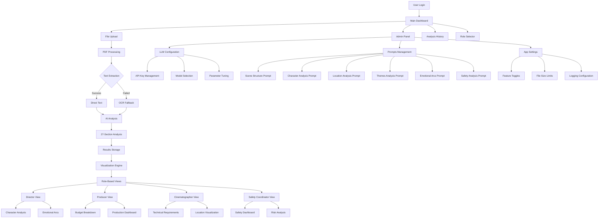

# CortexReel User Flow Diagram

This diagram shows the complete user journey from login through file upload, analysis, and role-based visualization, including the admin panel integration.

## Key Flow Points

1. **Entry Point**: User authentication and main dashboard access
2. **Core Functions**: File upload, admin configuration, analysis history
3. **Processing Pipeline**: PDF → Text Extraction → AI Analysis → Results
4. **Admin Configuration**: Three-tab interface for comprehensive system setup
5. **Role-Based Output**: Specialized views for different film industry roles 