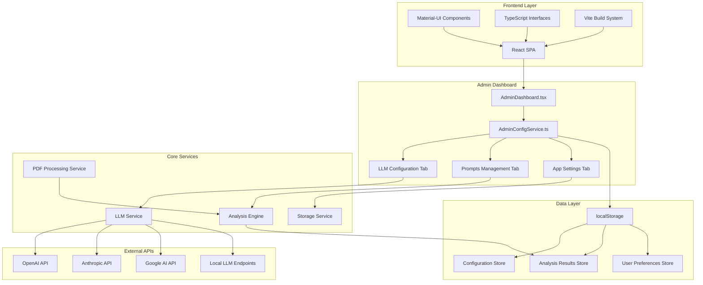

# CortexReel System Architecture

This diagram displays the layered architecture with Frontend, Admin Dashboard, Core Services, Data Layer, and External APIs.

## Architecture Layers

1. **Frontend Layer**: React SPA with Material-UI, TypeScript, and Vite
2. **Admin Dashboard**: Three-tab configuration interface with centralized service
3. **Core Services**: Business logic for LLM, PDF processing, analysis, and storage
4. **Data Layer**: localStorage-based persistence with organized stores
5. **External APIs**: Multiple LLM provider integrations 