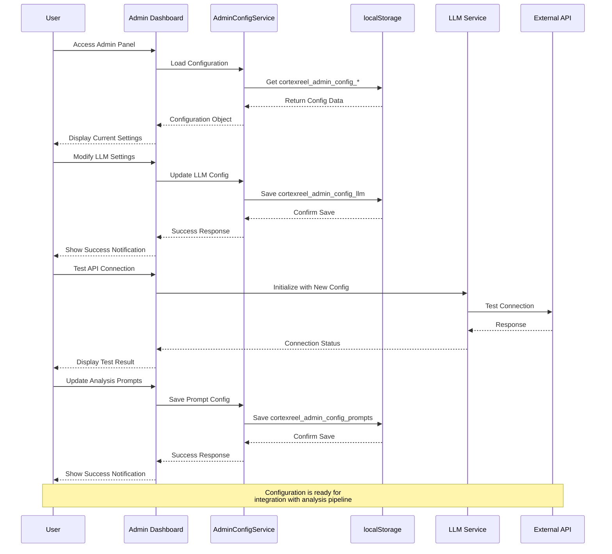

# Configuration Management Sequence

This sequence diagram illustrates the step-by-step process of how users interact with the admin dashboard to configure LLM settings, save configurations, and test connections.

## Sequence Flow Steps

1. **Initial Load**: User accesses admin panel, system loads existing configuration
2. **Configuration Update**: User modifies settings, system persists to localStorage
3. **Connection Testing**: System validates API connectivity with new settings
4. **Prompt Management**: User updates analysis prompts, system saves changes
5. **Integration Ready**: Configuration prepared for analysis pipeline integration 