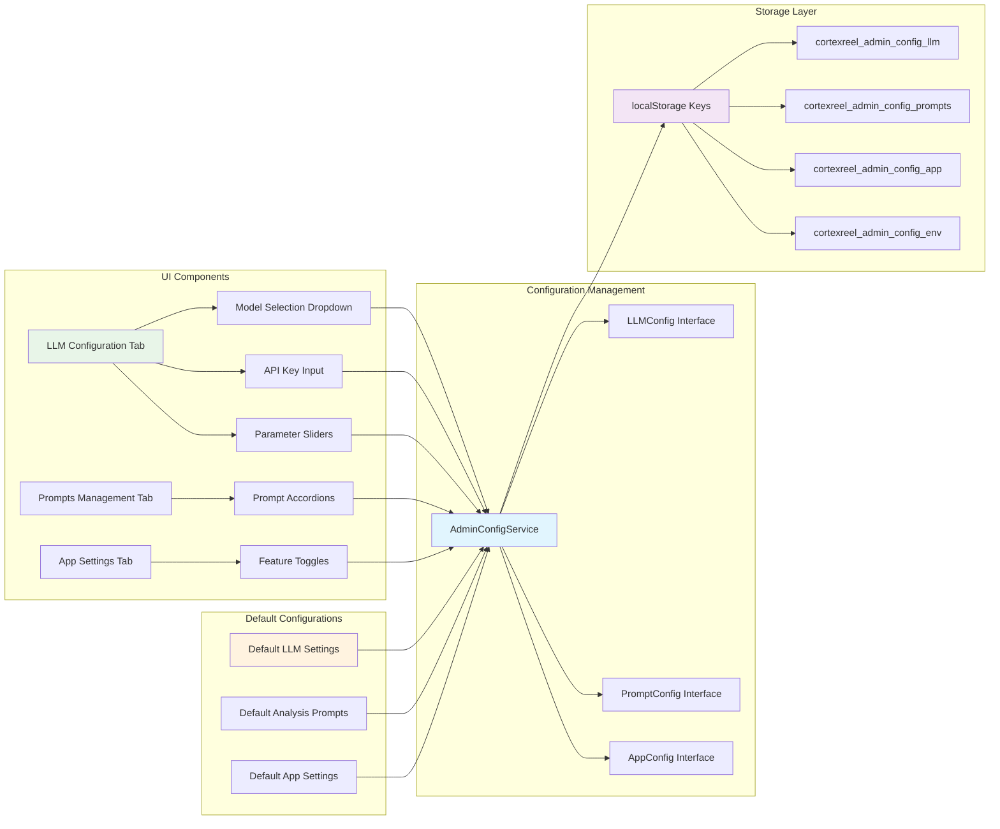

# Configuration Architecture Detail

This diagram shows the detailed structure of the AdminConfigService, storage patterns, UI components, and default configurations with their relationships.

## Configuration Components

1. **Service Layer**: AdminConfigService with TypeScript interfaces for type safety
2. **Storage Strategy**: localStorage with prefixed keys for namespace isolation
3. **UI Components**: Three-tab interface with specialized controls for each configuration type
4. **Default Values**: Comprehensive defaults for LLM settings, prompts, and app configuration
5. **Data Flow**: Bidirectional flow between UI components and storage through service layer 