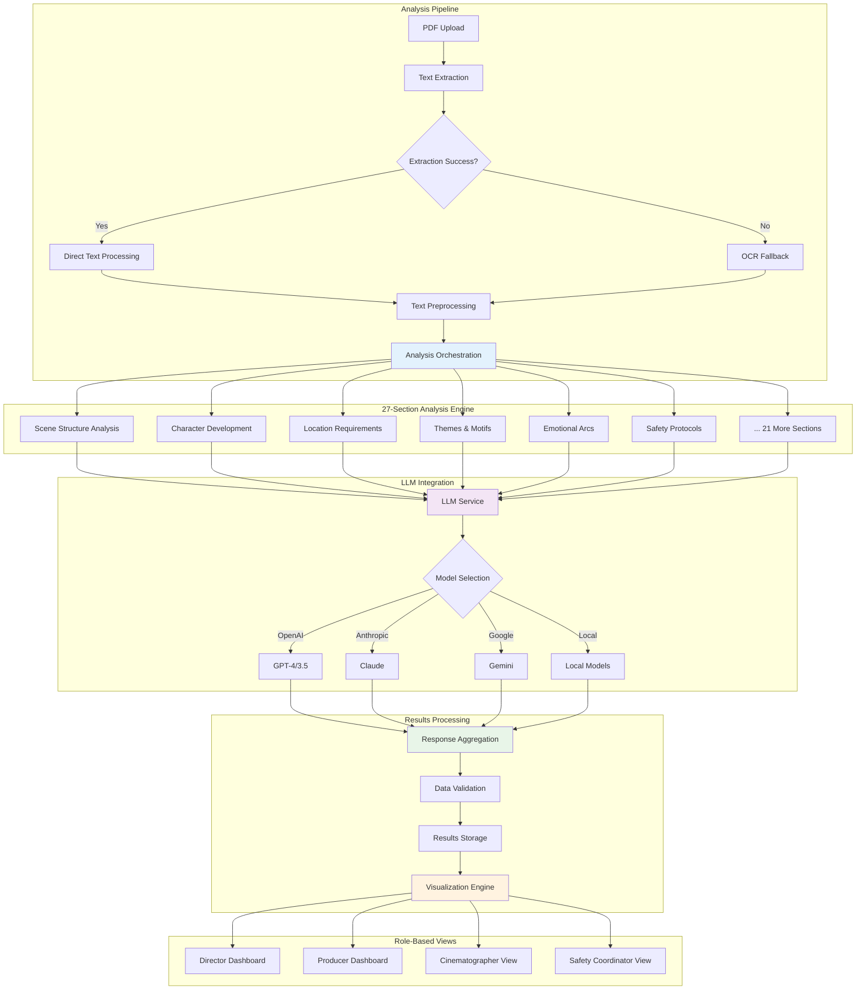

# Analysis Pipeline Flow

This diagram demonstrates the 27-section analysis engine, LLM integration with multiple providers, and how results flow to role-based dashboards.

## Pipeline Stages

1. **Input Processing**: PDF upload with dual extraction strategy (direct + OCR fallback)
2. **Analysis Engine**: 27-section comprehensive screenplay analysis
3. **LLM Integration**: Multi-provider support with configurable model selection
4. **Results Processing**: Aggregation, validation, and storage of analysis results
5. **Visualization**: Role-based dashboards for different film industry professionals 