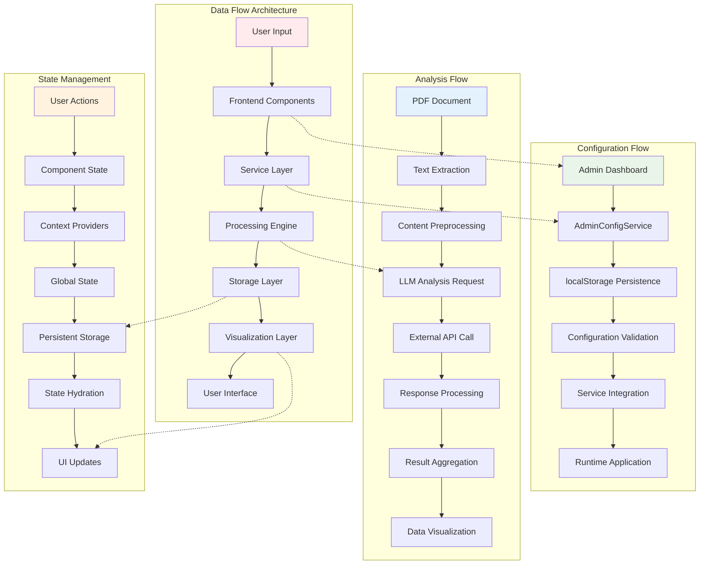

# Data Flow Architecture

This diagram presents four parallel flows: general data flow, configuration flow, analysis flow, and state management, showing how they interconnect.

## Flow Interconnections

1. **General Data Flow**: User input through processing to visualization
2. **Configuration Flow**: Admin settings through validation to runtime application
3. **Analysis Flow**: Document processing through LLM analysis to visualization
4. **State Management**: User actions through global state to UI updates
5. **Cross-Flow Integration**: Dotted lines show how flows interconnect at key points 