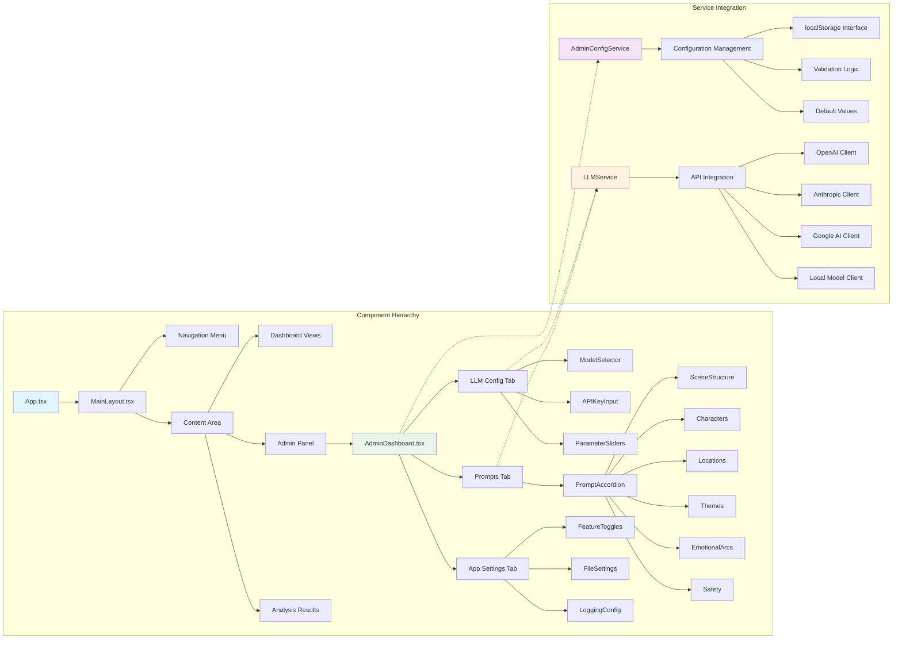

# Component Hierarchy & Service Integration

This diagram details the React component structure and service layer integration, showing how the admin dashboard connects to configuration and LLM services.

## Component Structure

1. **App Structure**: App.tsx → MainLayout.tsx → Content routing
2. **Admin Dashboard**: Three-tab interface with specialized components
3. **Configuration Components**: Model selectors, API inputs, parameter controls
4. **Prompt Management**: Accordion interface for six analysis sections
5. **Service Integration**: AdminConfigService and LLMService with API clients 