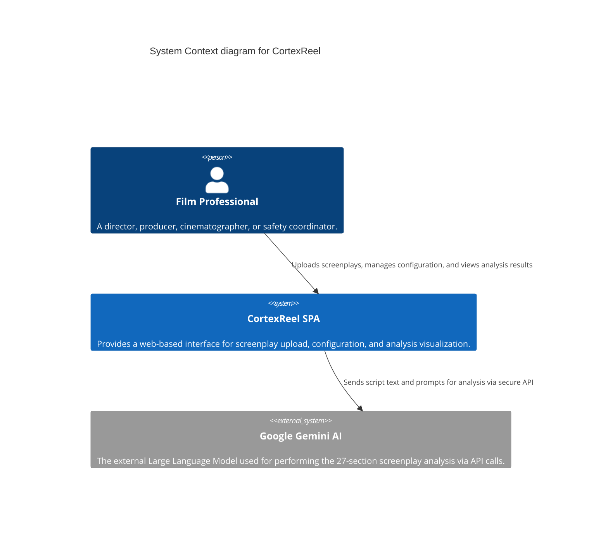

# CortexReel - Project Brief

## Project Metadata
- **Version:** 1.0.0
- **Owners:** CortexReel Development Team
- **Deadlines:** Q2 2025 - Backend Integration Phase Completion
- **OKRs:**
  - **Objective 1:** Deliver a professional-grade, AI-powered analysis tool that reduces screenplay breakdown time from weeks to minutes.
    - **KR1:** Achieve analysis completion for a 120-page script in under 5 minutes.
    - **KR2:** Ensure all 27 analysis sections operate with >95% reliability for standard screenplay formats.
  - **Objective 2:** Establish CortexReel as an intuitive and indispensable tool for film industry professionals.
    - **KR1:** Achieve a user satisfaction score of >4.5/5 based on feedback surveys.
    - **KR2:** Ensure exported analysis results are 100% compatible with standard production workflows (e.g., importable into scheduling software).

## System Boundary Diagram (C4 Level 1)

## Podstawowe Informacje

**Nazwa projektu:** CortexReel  
**Typ aplikacji:** React TypeScript SPA  
**Główny cel:** Profesjonalna platforma analizy scenariuszy filmowych z 27 sekcjami analizy  
**Grupa docelowa:** Profesjonaliści branży filmowej (reżyserzy, producenci, operatorzy kamery, koordynatorzy bezpieczeństwa)

## Kluczowe Wymagania

### Funkcjonalne
1. **Upload i parsowanie plików PDF scenariuszy**
   - Obsługa plików do 10MB
   - Bezpośrednia ekstrakcja tekstu + fallback OCR (Tesseract.js)
   - Walidacja formatu i rozmiaru

2. **27-sekcyjna analiza przy użyciu Google Gemini AI**
   - Metadata scenariusza
   - Struktura scen  
   - Analiza postaci i relacji
   - Lokacje i wymagania techniczne
   - Analiza budżetu i ryzyka
   - Koordynacja bezpieczeństwa i kaskaderów
   - Analiza emocjonalna i psychologiczna

3. **Wizualizacje i dashboardy**
   - Interactive charts (Recharts)
   - Role-based filtering (different views for different film roles)
   - Responsive design with Material-UI

4. **Session Management**
   - Analysis history with persistence (Zustand)
   - Results export (PDF, CSV, JSON)
   - Autentykacja (obecnie proste hasło)

### Niefunkcjonalne
- **Wydajność:** Web Workers dla przetwarzania PDF/OCR
- **Bezpieczeństwo:** Klucz API Gemini w zmiennych środowiskowych
- **UX:** Dark mode jako domyślny (standard branży filmowej)
- **Accessibility:** WCAG 2.1 AA compliance
- **Responsywność:** Mobile-first design

## Kluczowe Ograniczenia

1. **Przetwarzanie po stronie klienta** - całość analizy w przeglądarce
2. **Klucz API Gemini** - obecnie w env variables (potencjalne ryzyko bezpieczeństwa)
3. **Brak backendu** - wszystko w localStorage i pamięci
4. **Dependency na Google Gemini** - zewnętrzny serwis krytyczny dla funkcjonalności

## Sukces Projektu

Projekt będzie uznany za udany, gdy:
- Profesjonaliści filmowi będą mogli analizować scenariusze w <5 minut
- Wszystkie 27 sekcji będą działać niezawodnie  
- Wizualizacje będą użyteczne i intuitive dla każdej roli filmowej
- Aplikacja będzie działać offline po pierwszym załadowaniu
- Export wyników będzie kompatybilny z workflow'ami produkcyjnymi

## Główne Ryzyka

1. **Limity API Gemini** - quota/rate limiting
2. **Rozmiar plików PDF** - OCR może być wolny dla dużych plików
3. **Kompatybilność przeglądarek** - szczególnie Web Workers i PDF.js
4. **Bezpieczeństwo klucza API** - ekspozycja w client-side kodzie 