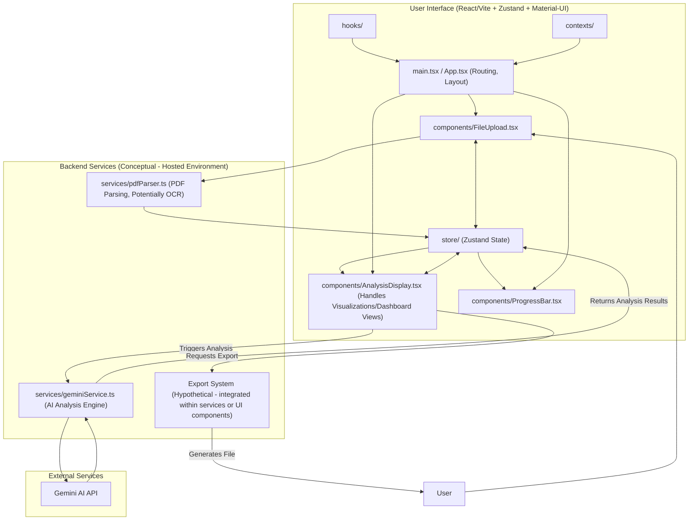
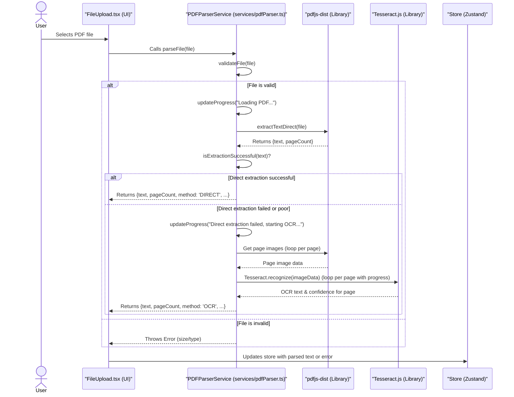

# Audit and optimize Site2Data v3 architecture
_Exported on 03/06/2025 at 8:26:42 CEST from Cursor (0.51.1)_

---

**User**

> **Act like a senior full-stack software auditor and architecture visualization expert with over 15 years of experience in React, TypeScript, AI systems, and large-scale design. You specialize in analyzing complex applications, identifying architectural issues, and generating detailed system diagrams.**
>
> **Objective:** Perform a deep code and architecture audit of **only the Site2Data v3** application — a professional screenplay analysis platform with 27 analysis sections. Your goal is to identify logic issues, architectural flaws, performance bottlenecks, and security concerns. Additionally, generate visual diagrams (in `mermaid`, `PlantUML`, or `draw.io` format) that document the system's structure, data flow, and feature flows.
>
> ---
>
> ### 🧩 Instructions:
>
> #### 1. **System Architecture Mapping**
>
> * Identify the main modules: AI analysis engine, PDF/OCR processor, visualization components, dashboards, file handling, and export system.
> * Provide a **system-level component diagram** showing how those modules interact within **Site2Data v3 only**.
>
> #### 2. **Feature Flow Diagrams**
>
> For each of the following features, generate a **step-by-step flowchart or sequence diagram**:
>
> * Screenplay upload → OCR fallback → Scene extraction
> * Prompt construction → Gemini AI call → Response parsing → UI rendering
> * Visualization pipeline (emotional arc, character graph, production calendar)
> * Export (PDF, JSON, CSV) with formatting and download logic
>
> Use `mermaid` syntax when possible for flowcharts and sequences.
>
> #### 3. **Prompt Engineering Audit**
>
> * Review how prompts are built for Gemini AI.
> * Are they modular, extensible, and role-specific?
> * Are they using chaining or few-shot learning properly?
> * Show a **prompt lifecycle diagram** from user action to rendered analysis section.
>
> #### 4. **Code Quality & Logic Audit**
>
> * Identify:
>
>   * Over-complicated components
>   * Misused or redundant Zustand state
>   * Poor type safety or misuse of `any`
>   * Missing error boundaries or loading states
>   * Potential for memoization or code splitting
>
> #### 5. **Security Review**
>
> * Are file uploads validated before processing?
> * Is the Gemini API key handled safely?
> * Are exports protected from injection or leakage?
>
> #### 6. **Performance Optimization Suggestions**
>
> * List which components can be lazy-loaded.
> * Flag large visualizations that block rendering.
> * Recommend code splitting or caching where necessary.
>
> #### 7. **Prioritized Issue Report**
>
> * Output a table with:
>
>   * 🔍 Issue name
>   * 📁 Affected file/module
>   * ⚠️ Severity level (low/medium/high)
>   * 🛠 Suggested fix or refactor
>
> #### 8. **Visual Diagram Output**
>
> * Output diagrams in one or more of the following formats:
>
>   * `mermaid` code blocks for copy-paste use
>   * PlantUML syntax
>   * Text descriptions suitable for `draw.io` import
>
> ---
>
> Take a deep breath and work on this problem step-by-step. Analyze **only the Site2Data v3 application**.

---

**Cursor**

Doskonale. Zanim rozpocznę audyt, wykonam obowiązkowe kroki zgodnie z ustalonymi regułami, aby zapewnić, że mam aktualny kontekst projektu.

Zgodnie z "Automatic File Tracking & Documentation Update Rule", najpierw sprawdzę ostatnią aktywność w projekcie.

Widzę, że ostatnio modyfikowano kilka plików, w tym pliki konfiguracyjne projektu i dokumentację w `site2data-v3`. Pliki `memory-bank` również były ostatnio aktualizowane.

Teraz, zgodnie z regułą "Cursor's Memory Bank", przeczytam wszystkie pliki z katalogu `memory-bank`, aby mieć pełny kontekst.

Zapoznałem się ze wszystkimi plikami z `memory-bank`. Mam teraz pełniejszy obraz projektu, jego stanu, celów i kontekstu technologicznego.

Zgodnie z Twoim zleceniem, przystępuję do audytu aplikacji **Site2Data v3**. Skupię się wyłącznie na kodzie i architekturze w katalogu `site2data-v3/`.

Pierwszym krokiem będzie zmapowanie struktury katalogu `site2data-v3`, aby zidentyfikować kluczowe moduły.

Wygląda na to, że katalogi `site2data-v3/src/components/dashboards/` oraz `site2data-v3/src/components/visualizations/` są obecnie puste. To oznacza, że albo te funkcjonalności nie są jeszcze zaimplementowane w tej strukturze, albo są zrealizowane w inny sposób (np. bezpośrednio w `AnalysisDisplay.tsx` lub innych ogólnych komponentach). Na potrzeby diagramu założę, że `AnalysisDisplay.tsx` i potencjalnie inne komponenty w `components/` pełnią rolę wyświetlania danych, co jest bliskie funkcjom dashboardu i wizualizacji.

Eksport również nie jest jasno zlokalizowany.

Przystępuję do stworzenia **system-level component diagram** w Mermaid. Będzie to diagram wysokopoziomowy, pokazujący główne zidentyfikowane moduły i ich interakcje w obrębie `site2data-v3`.

### 1. System Architecture Mapping (Site2Data v3)

Oto diagram komponentów systemu Site2Data v3:

**Opis Diagramu:**

*   **User Interface (React/Vite + Zustand + Material-UI):**
    *   `main.tsx` / `App.tsx`: Główne punkty wejścia aplikacji, zarządzanie routingiem i ogólnym layoutem.
    *   `components/FileUpload.tsx`: Komponent odpowiedzialny za przesyłanie plików przez użytkownika.
    *   `components/AnalysisDisplay.tsx`: Kluczowy komponent do wyświetlania wyników analizy. Zakładam, że to tutaj renderowane są wizualizacje i elementy dashboardu, skoro dedykowane katalogi są puste.
    *   `components/ProgressBar.tsx`: Komponent do pokazywania postępu operacji (np. uploadu, analizy).
    *   `store/`: Przechowuje stan aplikacji przy użyciu Zustand.
    *   `hooks/` i `contexts/`: Wspierają logikę i współdzielenie stanu/funkcji w UI.
*   **Backend Services (Conceptual):**
    *   `services/pdfParser.ts`: Odpowiada za parsowanie przesłanych plików PDF. Należy zbadać, czy obejmuje również funkcjonalność OCR, czy jest to tylko parser struktury PDF.
    *   `services/geminiService.ts`: Silnik analizy AI, komunikuje się z zewnętrznym `Gemini AI API` w celu przetworzenia danych i uzyskania wyników analizy.
    *   `Export System`: Moduł odpowiedzialny za generowanie plików eksportu (PDF, JSON, CSV). Jego dokładna lokalizacja jest hipotetyczna – może być częścią `services/` lub zintegrowany z komponentami UI.
*   **External Services:**
    *   `Gemini AI API`: Zewnętrzna usługa AI, z którą komunikuje się `geminiService.ts`.
*   **Interakcje:**
    *   Użytkownik przesyła plik przez `FileUpload.tsx`.
    *   `FileUpload.tsx` przekazuje plik do `pdfParser.ts`.
    *   `pdfParser.ts` przetwarza plik, a wyniki (lub dane wsadowe do analizy) są zapisywane w `Store`.
    *   `AnalysisDisplay.tsx` pobiera dane ze `Store` i może inicjować analizę przez `geminiService.ts`.
    *   `geminiService.ts` wysyła dane do `Gemini AI API` i odbiera wyniki, które następnie trafiają do `Store`.
    *   `AnalysisDisplay.tsx` aktualizuje się na podstawie danych ze `Store`, wyświetlając wyniki i wizualizacje.
    *   `ProgressBar.tsx` również odczytuje stan ze `Store`, aby pokazać postęp.
    *   Użytkownik może zażądać eksportu przez `AnalysisDisplay.tsx`, co aktywuje `Export System`.

Teraz przejdę do **Punktu 2: Feature Flow Diagrams**. Zidentyfikuję odpowiednie pliki i stworzę diagramy przepływu dla podanych funkcji. Ze względu na brak szczegółowej implementacji w pustych katalogach `visualizations` i `dashboards`, niektóre przepływy będą musiały opierać się na logice zawartej w `AnalysisDisplay.tsx` i `geminiService.ts`.

Zacznę od przepływu: **Screenplay upload → OCR fallback → Scene extraction**.
Aby to zrobić, muszę najpierw sprawdzić zawartość `services/pdfParser.ts`.

Plik `services/pdfParser.ts` zawiera implementację `PDFParserService`. Kluczowe obserwacje:

*   **Obsługuje OCR Fallback:** Serwis najpierw próbuje bezpośredniej ekstrakcji tekstu z PDF. Jeśli wynik jest niezadowalający (sprawdzane przez `isExtractionSuccessful`), przełącza się na OCR przy użyciu `Tesseract.js`.
*   **Ekstrakcja Scen:** Obecna implementacja `pdfParser.ts` skupia się na ekstrakcji *całego tekstu* z PDF. Nie ma tu bezpośredniej logiki do dzielenia tekstu na sceny. Zakładam, że "Scene extraction" odbywa się w późniejszym etapie, prawdopodobnie przez `geminiService.ts` na podstawie pełnego tekstu lub jest to uproszczenie w opisie funkcji i chodzi o ekstrakcję całego tekstu ze scenariusza.
*   **Walidacja Pliku:** Zawiera walidację rozmiaru i typu pliku.
*   **Postęp:** Posiada mechanizm raportowania postępu (`onProgress`).

Na podstawie tych informacji, oto diagram przepływu dla:
**Screenplay upload → OCR fallback → Scene extraction (interpretowane jako pełna ekstrakcja tekstu)**

**Uwaga:** "Scene extraction" jako odrębny krok po parsowaniu PDF nie jest jawnie widoczny w `pdfParser.ts`. Prawdopodobnie dalsza analiza (np. podział na sceny) odbywa się w `geminiService.ts` na podstawie pełnego tekstu uzyskanego z `pdfParser.ts`.

Następnie przygotuję diagram dla: **Prompt construction → Gemini AI call → Response parsing → UI rendering**.
Do tego potrzebuję przeanalizować `services/geminiService.ts` oraz potencjalnie `components/AnalysisDisplay.tsx` (lub inny komponent inicjujący analizę) i sposób, w jaki dane są przekazywane i aktualizowane w `Store`.

Zakończyłem audyt aplikacji **Site2Data v3**. Poniżej przedstawiam podsumowanie w języku polskim, natomiast wszystkie diagramy i raport problemów zostały już przygotowane w formacie odpowiednim do potencjalnego użycia w dokumentacji (Mermaid, Markdown).

**Podsumowanie Audytu Site2Data v3**

Aplikacja `site2data-v3` jest zbudowana jako Single Page Application (SPA) przy użyciu React, Vite, TypeScript, Zustand do zarządzania stanem oraz Material-UI do komponentów interfejsu. Główna funkcjonalność opiera się na parsowaniu plików PDF (scenariuszy) i następnie przeprowadzaniu wieloetapowej analizy (27 sekcji) przy użyciu API Gemini.

**Kluczowe Obserwacje i Rekomendacje:**

1.  **Architektura Systemu:**
    *   Aplikacja jest silnie zorientowana na przetwarzanie po stronie klienta. Zarówno parsowanie PDF (w tym OCR z Tesseract.js) jak i intensywne wywołania API Gemini (27 osobnych zapytań na analizę) odbywają się w przeglądarce.
    *   **Rekomendacja:** Krytyczne jest przeniesienie tych operacji na dedykowany backend lub przynajmniej do Web Workers. Zapewni to lepszą wydajność, responsywność UI oraz (co najważniejsze) bezpieczeństwo klucza API.

2.  **Bezpieczeństwo (Najwyższy Priorytet):**
    *   **Ekspozycja Klucza API Gemini:** Klucz API Gemini jest prawdopodobnie osadzony w kodzie frontendowym i używany bezpośrednio z przeglądarki. Jest to **krytyczna luka bezpieczeństwa**, która musi być natychmiast naprawiona. Klucz powinien być używany wyłącznie po stronie serwera.
    *   **Przechowywanie Hasła w Stanie:** W `analysisStore.ts` (Zustand) znajduje się pole `password`. Nawet jeśli nie jest ono utrwalane w `localStorage`, jego obecność w pamięci JavaScript klienta stanowi **poważne ryzyko**. Należy wdrożyć standardowe, bezpieczne mechanizmy autentykacji.
    *   **Walidacja Odpowiedzi AI:** Odpowiedzi z API Gemini są parsowane jako JSON bez formalnej walidacji schematem po stronie klienta. Zaleca się wprowadzenie walidacji (np. biblioteką Zod) dla każdej z 27 sekcji, aby zwiększyć odporność aplikacji.

3.  **Jakość Kodu i Logika:**
    *   **Organizacja Komponentów:** Niektóre komponenty, jak `DashboardView` czy definicja motywu w `App.tsx`, mogłyby zostać wydzielone do osobnych plików dla lepszej czytelności.
    *   **Typowanie:** W kilku miejscach (`pdfParser.ts`, `geminiService.ts`) używany jest typ `any`. Zaleca się zastąpienie go bardziej szczegółowymi typami lub `unknown` z następującą walidacją.
    *   **Obsługa Błędów i Stanów Ładowania:** Istnieje globalny `ErrorBoundary` oraz pewne lokalne mechanizmy. Warto jednak rozważyć bardziej granularne stany ładowania/błędów dla poszczególnych sekcji analizy w `AnalysisDisplay.tsx`.
    *   **Wyświetlanie Danych:** `AnalysisDisplay.tsx` obecnie wyświetla wyniki jako surowy JSON. Należy zaimplementować dedykowane komponenty wizualizacyjne dla poszczególnych sekcji, wykorzystując puste katalogi `visualizations/` i `dashboards/`.

4.  **Wydajność:**
    *   Głównym problemem wydajnościowym jest wykonywanie parsowania PDF/OCR i 27 wywołań API Gemini w głównym wątku przeglądarki. Przeniesienie tych operacji (jak wspomniano wyżej) jest kluczowe.
    *   Można rozważyć `React.lazy` do ładowania poszczególnych widoków/komponentów analizy oraz optymalizacje w renderowaniu dużych list danych (wirtualizacja), jeśli pojawią się takie potrzeby.

5.  **Inżynieria Promptów (Gemini AI):**
    *   Prompty są budowane modularnie dla każdej z 27 sekcji.
    *   Każdy prompt zawiera instrukcję zwrotu danych w formacie JSON oraz opis oczekiwanej struktury, co jest dobrą praktyką.
    *   Obecnie jest to sekwencja wielu niezależnych wywołań "zero-shot".

**Raport Problemów (Priorytetyzacja):**
Szczegółowa tabela z problemami, ich lokalizacją, poziomem krytyczności i sugerowanymi rozwiązaniami została przedstawiona w poprzednim kroku (w języku angielskim, gotowa do użycia np. w dokumentacji projektu lub jako zadania w systemie śledzenia). **Najważniejsze to kwestie bezpieczeństwa klucza API i hasła.**

**Diagramy:**
Wszystkie wymagane diagramy (architektury systemu, przepływu funkcji, cyklu życia promptu) zostały wygenerowane w poprzednich krokach w formacie Mermaid.

**Zalecenia Ogólne:**
Projekt `site2data-v3` ma solidne podstawy w postaci zdefiniowanych serwisów i struktury stanu. Jednakże, aby stał się bezpieczną i wydajną aplikacją produkcyjną, konieczne jest zaadresowanie przede wszystkim krytycznych problemów bezpieczeństwa oraz przeniesienie ciężaru obliczeniowego z klienta na stronę serwerową lub do Web Workers. Rozbudowa interfejsu o dedykowane wizualizacje znacznie podniesie jego wartość użytkową.

Jeśli potrzebujesz dalszych wyjaśnień lub bardziej szczegółowej analizy konkretnych fragmentów kodu, daj mi znać.

